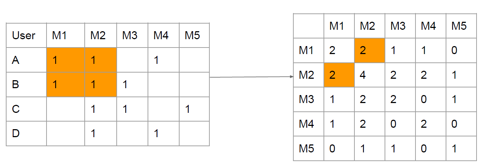
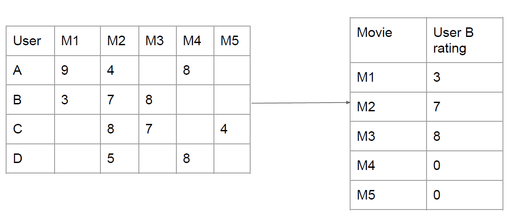
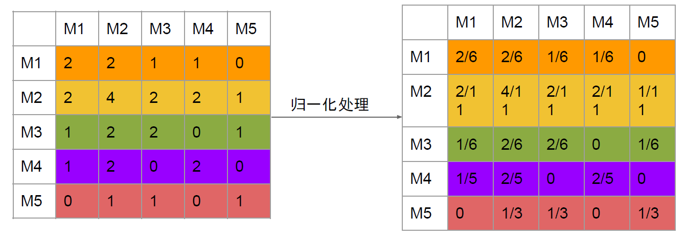
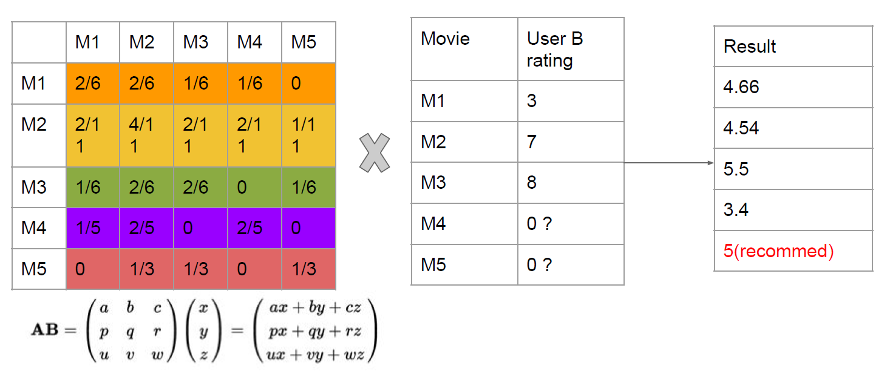
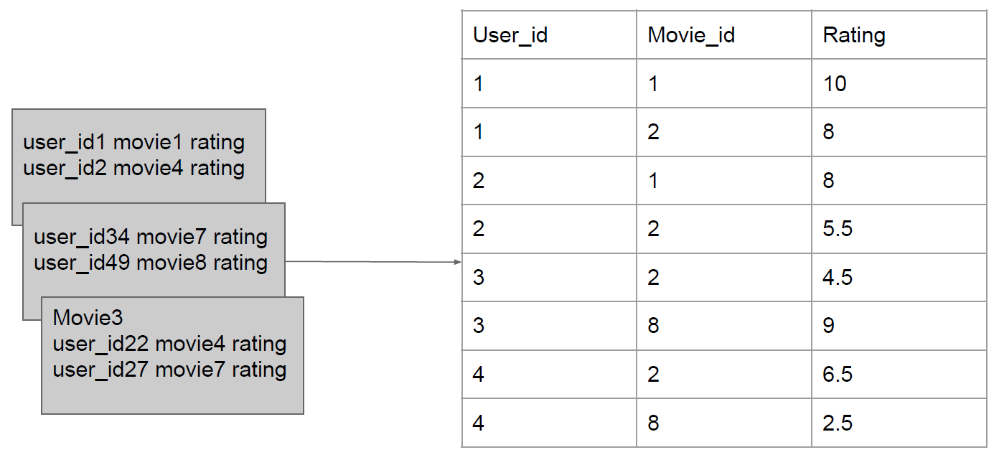
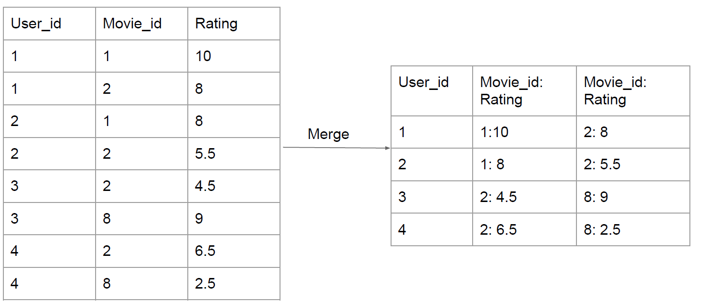
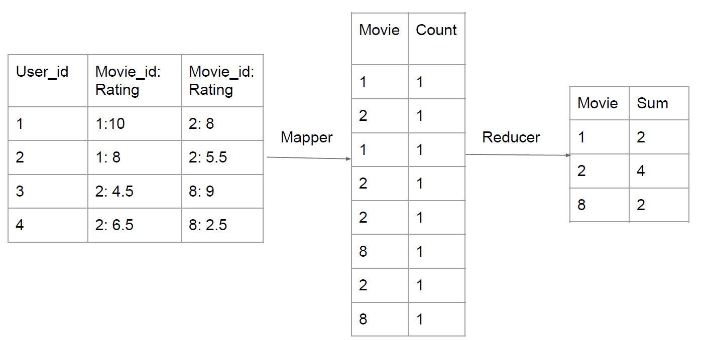
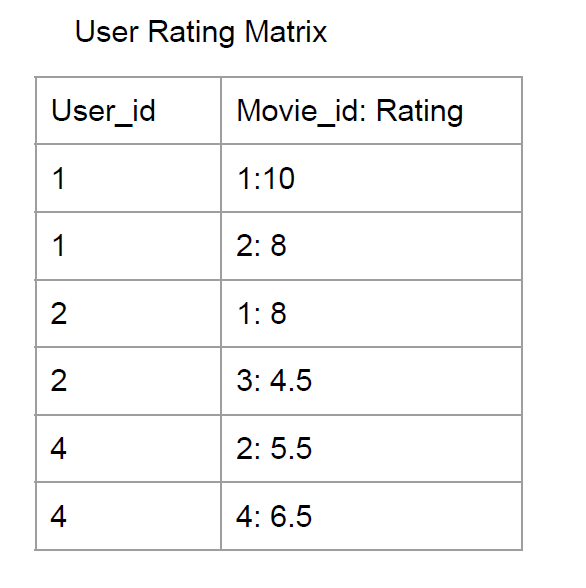
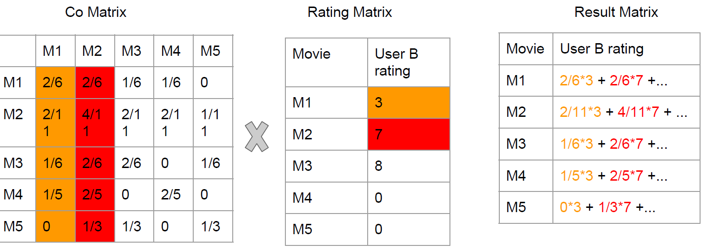

# Recommender System with MapReduce
This project combines two prominent machine learning / big data technologies: MapReduce and recommendation. 

Foundational amongst those technologies are the resilient Google File System (GFS) and a computing paradigm known as MapReduce. Google published their work in a few highly influential papers. Researchers, inspired by these descriptions, created open source versions, which eventually became the big data platform now known as Hadoop. 

## Item Collaborative Filtering (Item CF)

A form of collaborative filtering based on the similarity between items calculated using people's ratings of those items.

| User | Movie 1 | Movie 2 | Movie 3 | Movie 4   |
| ---- | ------- | ------- | ------- | --------- |
| A    | 10      | 4       | 9       | 9         |
| B    | 5.5     | 8       | 5       | 5         |
| C    | 8       | 2       | 8.5     | recommend |

Item CF is used because:

1. The number of users weighs more than number of products
2. Item will not change frequently, lowering calculation
3. Using user’s historical data, more convincing

### Build Co-occurrence matrix

#### Describe the relationship between different items.

Use rating history to build relationship between movies:

- If one user rated two movies, these two are related

#### Represent relationship between different items.

A co-occurrence matrix is a matrix that is defined over an image to be the distribution of co-occurring pixel values (grayscale values, or colors) at a given offset.

value(M1,M2) = Count(x_M1 && x_M2)  x: a person that watches both M1 and M2

### Build rating matrix

Tell the difference between movies towards each user.

| User | Transformers | Tiny Times |
| ---- | ------------ | ---------- |
| A    | 10           | 4          |
| B    | 3            | 9          |

Build rating matrix for each user

### Multiply co-occurrence matrix and rating matrix

#### Normalization on Co-occurrence Matrix

#### Multiply Co-occurrence with Rating matrix

## Map Reduce

### **Store raw data in which format?**

1. Divide Data By User (mapper)
   
2. Merge data for same user_id (reducer)

### Build Co-occurrence Matrix

### Build Rating Matrix

### Multiply co-occurrence matrix and rating matrix

